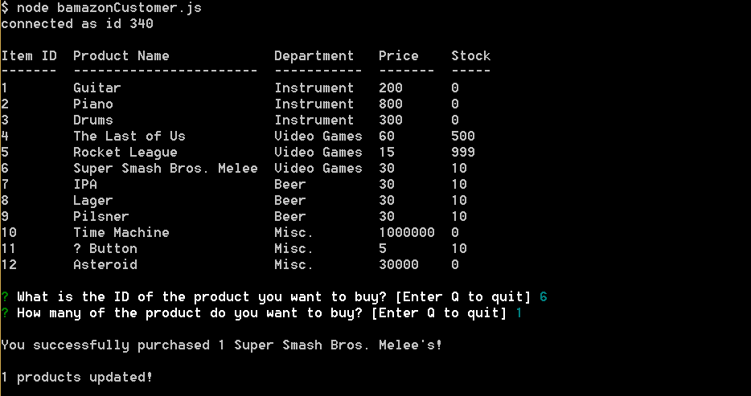

# bamazon
Customer and manager store application built with Node utilizing MySQL

# Link to deployed site
[GitHub](https://github.com/atton88/bamazon)

# Images

# technology used

- Node.js
- NPM: MySQL, inquirer, console.table

# Learning points

- Learned more node.js
- Learned to use npm inquirer to ask questions and wait for responses
- Learned to use MySQL to connect and manage database items
- Learned to use console.table to create tables in bash
- Learned to import and require other js files

# Author 
<!-- make a link to the deployed site and have your name as the link -->
[Andrew Ton](https://github.com/atton88)

# License
Standard MIT License